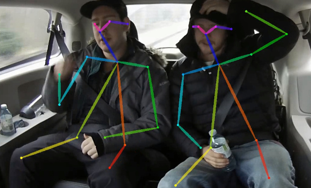
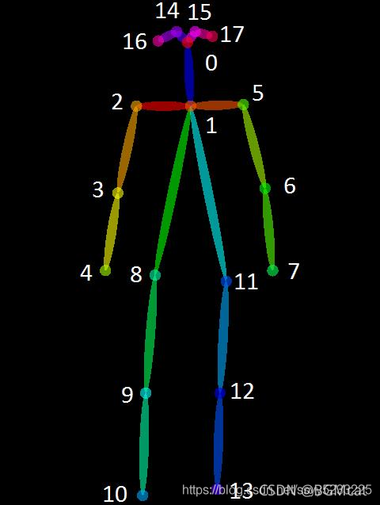

# **项目说明：**

本项目是在论文**Real-time 2D Multi-Person Pose Estimation on CPU**提供的代码基础上进行的功能实现。

上述论文是基于OpenPose算法进行了改进，引入了MobileNet作为轻量化网络加快推理速度。

由于实验环境受限，本项目**没有再进一步训练**，而是直接使用上述提供的预权重进行**运动检测**功能实现【预权重链接见文末】。

# **项目已实现功能：**

**人体关键点检测**

**深蹲运动状态检测**

------

# 环境

```
windows 10
NVIDIA GTX 1650
CPU intel i5 9th
CUDA 10.2

torch>=0.4.1
torchvision>=0.2.1
pycocotools==2.0.0
opencv-python>=3.4.0.14
numpy>=1.14.0
```

------

# 代码使用

克隆本repo至本地

将预权重放到weights文件下

## 关键点检测：

### **图像检测**

```shell
python demo.py --checkpoint-path weights/checkpoint_iter_370000.pth --images [your image path]
```


<p align="center">
  
</p>

### **视频检测**

```shell
python demo.py --checkpoint-path weights/checkpoint_iter_370000.pth --video [your video path]
```


<p align="center">
  
</p>

## 深蹲检测

目前仅支持**深蹲运动视频**检测，后期会逐渐增加其他运动检测，当然大家可以根据代码按需自己增加。

关于运动检测，采用**关键点距离**和**角度**两种方法同时检测(如果你只需要一种，在demo.py的131行[距离]和132行[角度]注释掉一行即可)。同时检测过程中增加了**能量环**进行状态的判断，如果动作到位并达标，那么能量环就会充满。

```shell
python demo.py --checkpoint-path weights/checkpoint_iter_370000.pth --video [video path] --Squat --dis_thres 160 --min_angle_thres 45. --max_angle_thres 130. --step 40
```


参数说明： Squat是进行深蹲运动检测；

​					dis_thres是关键点距离检测阈值，小于该阈值触发并充能，默认160；

​					min_angle_thres是膝盖弯曲角度最小阈值，默认45°，max_angle_thres是最大角度阈值，默认130°，当弯曲角度处于两者之间时触发能量环充能；

​					step是能量环充能速度，值越大，触发越快；

注意：上述阈值参数根据实际情况使用，有时候会受到不同视频分辨率的影响。

【视频来源于网络，如有侵权请与我联系】

<p align="center">
  
</p>

------

关键点说明：

采用18关键点

<p align="center">
  
</p>

------

说明：在实际的测试中，发现会有抖动，加入平衡或者跟踪还是有这现象，大家可以尝试对模型进一步的训练，而且网络采用的是轻量化网络，精度上会有影响。

------
代码中增加了关键点热力图可视化工具，具体代码在tools/Net_Vision.py

如本代码对您有帮助，还请帮忙点下stars

权重：

链接：https://pan.baidu.com/s/17aHEelxxO5RhkZWm97YHJg 
提取码：yypn

如果需要详细的训练过程，可以参考：https://github.com/Daniil-Osokin/lightweight-human-pose-estimation.pytorch#pre-trained-model
